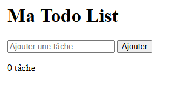

# Todo List Javascript

Une application de Todo List réalisée en HTML, CSS et Javascript.

## Fonctionnalités

- Ajouter une tâche
- Supprimer une tâche
- Marquer une tâche comme terminée
- Sauvegarde automatique avec localStorage
- Ajout avec la touche Entrée
- Compteur de tâches

## Technologies utilisées

- HTML5
- CSS3
- JavaScript

## Screenshot



## Lien du projet

https://malikatoukouta.github.io/TodoList/

## Installation

1. Cloner le projet

```bash
git clone https://malikatoukouta.github.io/TodoList/
```

2. Ouvrir le fichier `index.html`

## Auteur

Projet réalisé par Adamou Abdourmalik